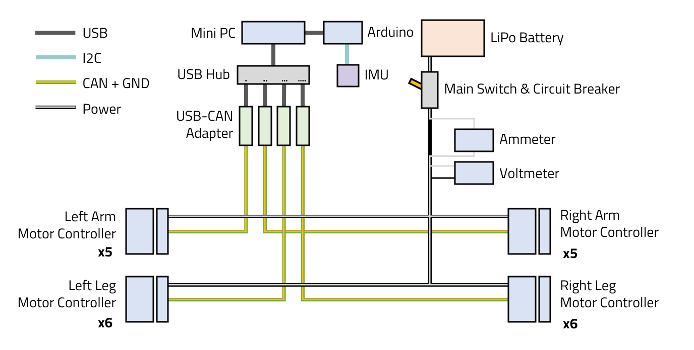

# Everything about Humanoid Robot

### -T.K.- [-T.K.- LAB Notes](https://tk233.gitbook.io/notes)
-> Berkeley Humanoid maker. 

### Skyentific

[Simulation took Control of my Robot Arm (NVIDIA Isaac Sim) ](https://www.youtube.com/watch?v=Eb2zuQxOBlY) -> NVIDIA Isaac Sim : sim to real 

[How to build Humanoid: NVIDIA Isaac Lab, how to walk](https://youtu.be/xwOaStX0mxE?si=xmj8PUcImFk8NE5G) -> NVIDIA Isaac Lab : Reinforcement Learning

[How to build Bipedal Robot](https://www.youtube.com/watch?v=pZnzG8EVkuA) -> This is really close to what I want to make

### Aaed Musa [Documentation](https://www.aaedmusa.com/projects/cara)

[This Robot Glides Like an Ice Skater](https://www.youtube.com/watch?v=WIU8gnqQJJM) -> This is really close to what I want to make. I want to make my robot with battery of drills(Dewalt)

### Bekeley Humanoid Lite DOCS [Documentation](https://berkeley-humanoid-lite.gitbook.io/docs) 
-> Theres really useful informations for Robot Building with simple explanations

Actuator Components : MAD5110 BLDC Motor + B-G431B-ESC1 + AS5600 encoder

Actuators are wired through adjacent neighboring actuators through CAN. And  via USB-CAN Adaptor, Actuators are connected to Central Controller(Mini PC in this picture) -> This is what I want to do!!
